#### Codespaces

GitHub Codespaces es un entorno de desarrollo integrado (IDE) basado en la web, completamente configurado y alojado en la nube, que permite a los desarrolladores escribir, compilar, probar y depurar código directamente desde GitHub. Codespaces proporciona una máquina virtual (VM) con todas las herramientas necesarias para trabajar en un proyecto, de modo que puedes desarrollar sin necesidad de configurar manualmente un entorno local.

Este ejercicio está configurado para crear un Codespace y se ejecuten las instrucciones necesarias para ambientar una maquina virtual y puedas hacer el ejercicio, es importante no alterar el Codespace.

Para acceder a los codespaces da click en <>Code, en la parte de la izquierda de tu pantalla, despues da click en <>Code que está en verde, podrás ver un boton que dice CrearCodespace on main.

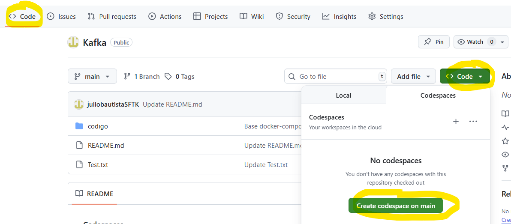 

# **Instrucciones**

Este código se ejecuta en lo que llamamos Codespaces.

Contiene lo necesario para levantar los contenedores para ver la funcionalidad de kafka.

kafka-app

kafka

zookeeper

postgres

mongo

# **Crear las contenedores**

Abre tu Codespeaces. 

una vez que te presente la terminal, cambiate al directorio codigo.

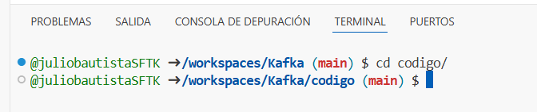 

Para copiar al codespace debes permitir el copiado.

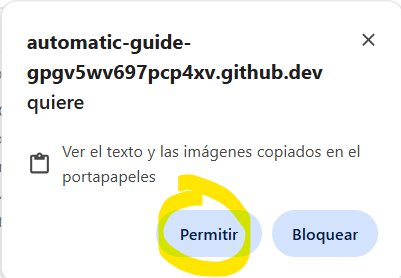 

Compila el código que viene en este ejercicio, no es necesaio descargarlo, es parte del codespace.

primero

 #### mvn clean install

después

 #### mvn clean package

Ejecuta el docker-compose para levantar los contenedores y todos los demas servicios.

  #### docker compose up -d

Una vez que termine valida tecleando docker ps 

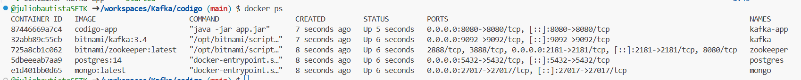 

Para ver el funcionamiento accede a puertos y selecciona el símbolo de mundo del que tiene puerto 8080.

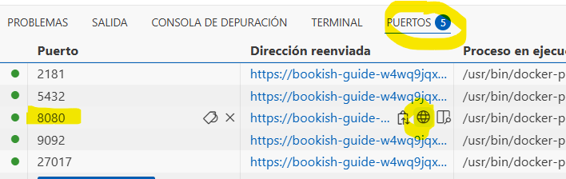 

Para ver el funcionamiento accede a puertos y selecciona el símbolo de mundo.

agrega al final de la url /api/kafka/send?message=Validando

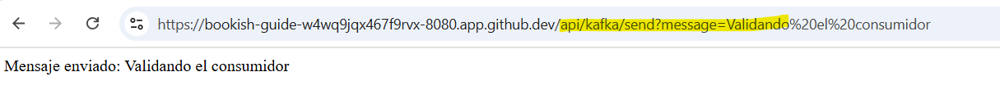 

En la terminal copia y pega esta instrucción. 

docker exec -it kafka kafka-console-consumer.sh \h --topic test-topic --from-beginning --bootstrap-server kafka:9092

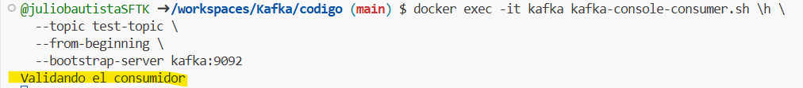 

Tambien puedes interactuar con el servicio de kafka con esta instrucción desde otra terminal que adiciones. 

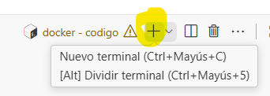 

curl -X POST "http://localhost:8080/api/kafka/send?message=HolaKafka"

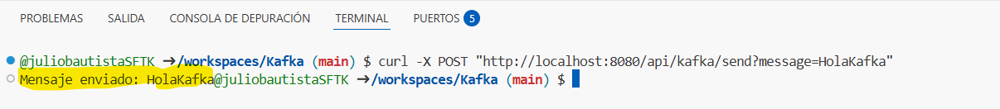 

Regresa a la terminal inicial y ve el resultado.

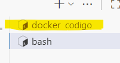 

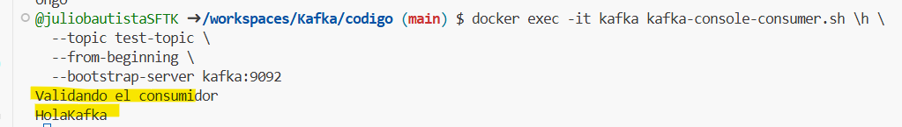 

Para validar lo que se ha grabado en mongo, utiliza estas instrucciones:

Entrar a dbmongo

#### docker exec -it mongo mongosh

Mostrar las bases de datos

#### show databases;

Usar las base de datos

#### use mensajesdb;

Ver los datos guardados

#### db.mensajes.find().pretty()

Puedes ocupar este espacio para seguir practicando o hacer tus propios ejercicios.

Es importante cerra el Codespace hasta finalizar. 

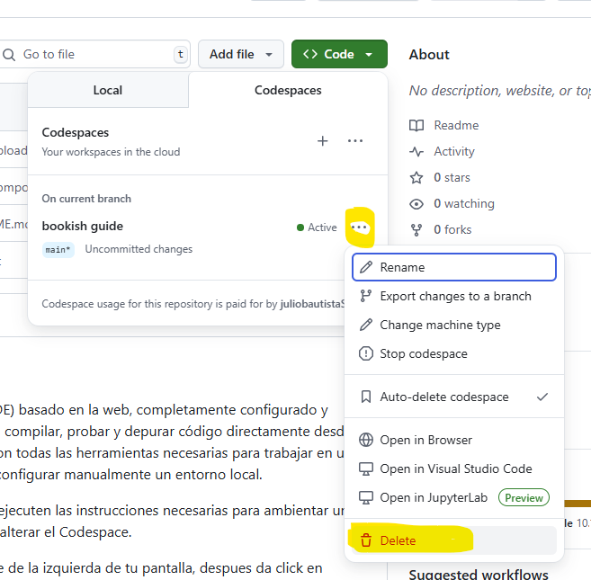 

